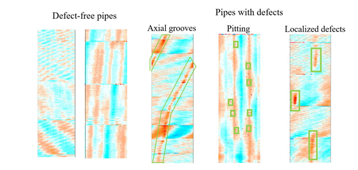
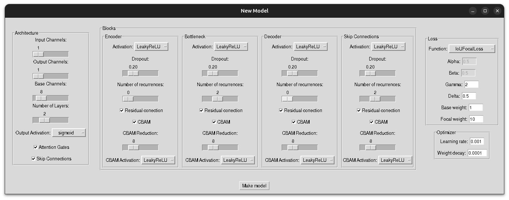
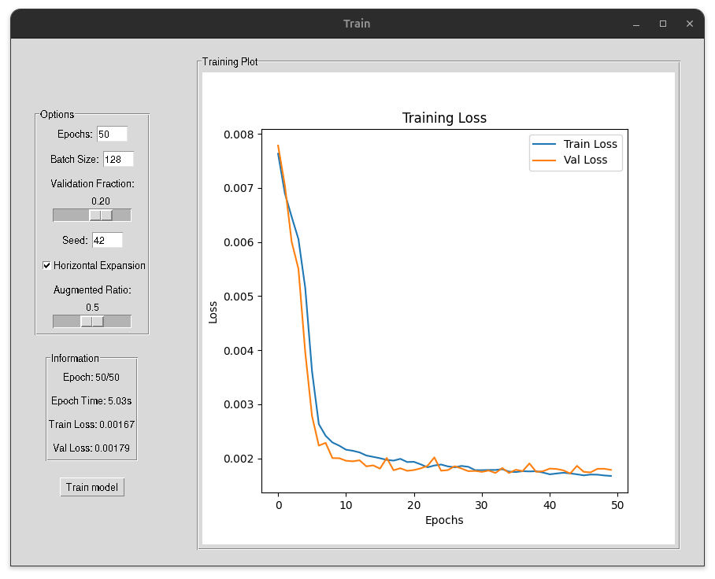
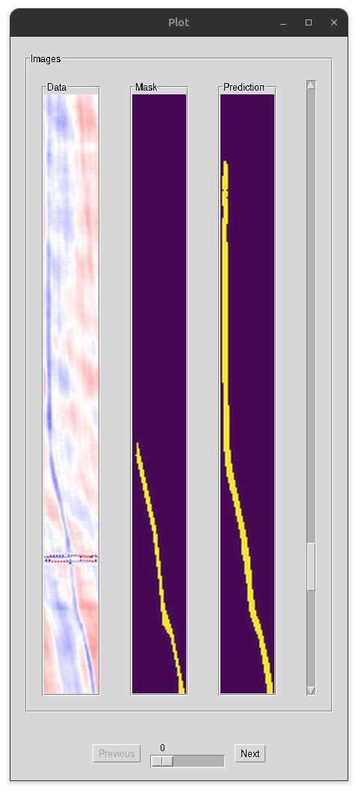

# CorroSeg: Corrosion Detection in Wells - U-Net Model Builder & Trainer

**CorroSeg** is a graphical user interface (GUI) application designed to build, train, and evaluate U-Net models in PyTorch for the segmentation and detection of corrosion defects in oil well pipes. The application was developed as part of the [SLB: Corrosion Detection in Wells Challenge](https://challengedata.ens.fr/participants/challenges/144/), where it achieved **1st place** with a IoU score of **0.6979** on the private test data.

## **Problem Description**

Corrosion-related failures represent one of the most critical hazards in the oil and gas industry, accounting for over 25% of total well failures. In the context of oil well maintenance, detecting corrosion is crucial to avoid potential environmental damage and to reduce operational costs.

The challenge focuses on identifying corrosion defects along steel pipes used in oil wells, based on ultrasonic imaging data. These images represent the pipe's thickness and are presented as 2D maps in cylindrical polar coordinates. The goal is to segment and identify corrosion defects, including:

- **Pitting Corrosion**
- **Localized Defects**
- **Axial Groove Defects**

<div style="text-align: center;">
    
    <p><em>Corrosion and wear defects examples.</em></p>
    <p><small>Image Source: <a href="https://challengedata.ens.fr/media/public/slb_2024_3.png" target="_blank">Corrosion Detection Challenge</a></small></p>
</div>

In this scenario, corrosion causes loss of metal thickness in the pipe, both on the inner and outer walls. Defects appear as red patterns in the thickness maps and vary in size, shape, and location. The goal is to produce a model that can accurately segment these defects from the images and classify them accordingly.

## **Features of the Application**

### **Model Creation**

- **Architecture:** 
  - Build and customize U-Net models with adjustable architecture parameters, including input/output channels, number of base channels, depth, activation functions, attention gates, residual connections, and more.
  - Configure the blocks in the encoder, decoder, bottleneck, and skip connections, with support for options like dropout, recurrent convolutions, and CBAM (Convolutional Block Attention Module).

- **Loss Function & Optimizer Configuration:**
  - Select and adjust loss functions such as DICE, IoU, MCC, Tversky, FocalLoss, and others.
  - Configure optimizer parameters, including learning rate and weight decay.

### **Data Handling**

- **Loading and Preprocessing:**
  - Import training data and corresponding masks from `.npy` files.
  - Automatic preprocessing to prepare the data for model training.

### **Training and Evaluation**

- **Train on CPU or GPU:** Automatically detects if CUDA is available for GPU-based training.
- **Training Configuration:** Set the number of epochs, batch size, validation fraction, and data augmentation options.
- **Data Augmentation:** Optionally create synthetic data to increase the size of the dataset, ensuring better generalization and improved model performance.
- **Monitoring and Visualization:** 
  - Visualize training and validation loss over epochs.
  - Track training duration for each epoch.
  - Generate plots and graphs for performance analysis.
- **Evaluation Metrics:** Calculate and display performance metrics such as accuracy, MCC, IoU, DICE, precision, recall, F1 score, and more.

### **Model Saving and Loading**: 
  - **Save Models**: After training, you can easily save your trained models for later use or deployment.
  - **Load Models**: You can load previously saved models to either continue training or use for making predictions.


### **Prediction and Visualization**

- **Prediction on New Data:** Use the trained model to make predictions on new, unseen data.

- **Visualization of Results:** Display results with overlays on the images, and save predictions as PNG, CSV, or NPY files.

## **Challenge Participation**

**CorroSeg** was developed specifically for the [SLB: Corrosion Detection in Wells Challenge](https://challengedata.ens.fr/participants/challenges/144/), with the goal of maximizing the intersection over union (IoU) score for groove defect segmentation.

- **Rank:** **1st Place** (Final score: 0.6979 on the private test data)
- **Problem:** The challenge involved detecting corrosion defects, including localized and axial groove defects, in ultrasonic images of well pipes.

## **Screenshots**

Here are some example screenshots of the application in action:
<div style="text-align: center;">
    

_Example of the Model Creation Interface where you can configure architecture parameters._
</div>

<div style="text-align: center;">
    

_Visualization of the training process with graphs showing the loss over epochs._
</div>

<div style="text-align: center;">
    

_Example of prediction results displayed on test data._
</div>

## **Project Organization**


    ├── LICENSE
    ├── README.md                   <- This document outlines the project workflow project.
    ├── main.py                     <- Main proyect file.
    ├── requirements.txt            <- The requirements file.
    ├── data
    │   └── train
    │       ├── X                   <- Well data in .npy format.
    │       └── y                   <- Mask data in .npy format.
    ├── images                      <- Contains the images for README.md. 
    └── src                         <- Contains the all source code files.
        ├── config                  <- Configuration files in .yaml format.
        ├── data                    <- Code related to preprocess of the data.
        ├── gui                     <- Code related to Graphical User Interface (GUI).
        ├── models                  <- Code related to build and train models.
        └── utils                   <- General functions. 

--------

## **How to Run the Project**

### **Prerequisites**
- Python >= 3.12
- PyTorch (with CUDA support for GPU usage)
- Required dependencies:
  - Tkinter (for the GUI)
  - NumPy
  - Pandas
  - Scipy
  - Matplotlib
  - OpenCV
  - Pillow (for image processing)
  - torchinfo (for model summaries)
  - IPython (for interactive use)
  - PyYAML (for reading configuration files)

### **Installation Instructions**

1. **Clone the repository:**
    ```bash
    git clone https://github.com/tamontealegrep/CorroSeg.git
    cd CorroSeg
    ```

2. **Install dependencies:**
    ```bash
    pip install -r requirements.txt
    ```

3. **Run the application:**
    ```bash
    python main.py
    ```

## **License**

This project is licensed under the Creative Commons Attribution-NonCommercial-NoDerivatives 4.0 International License.

You are free to share, copy, and distribute the material in any medium or format for non-commercial purposes, with proper attribution to the author. However, you cannot alter, transform, or build upon the material, nor can you use it for commercial purposes.

For more details, please refer to the full license at:
https://creativecommons.org/licenses/by-nc-nd/4.0/. 

---

## **Acknowledgments**
- Special thanks to the **SLB** team for organizing the challenge and providing the dataset.


